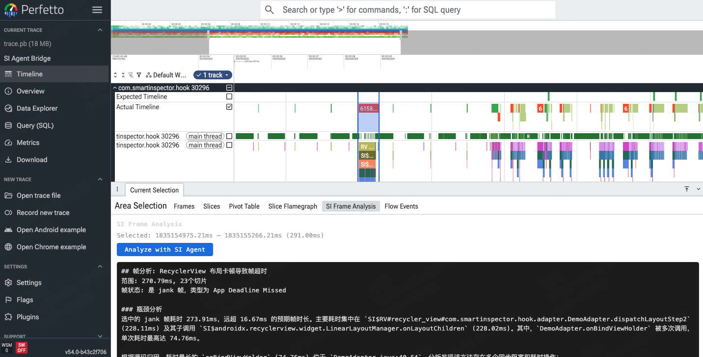

# SmartInspector

AI 驱动的跨平台移动端性能分析 CLI 工具。通过自然语言交互，自动采集设备性能 trace，分析性能瓶颈，并将热点归因到源码。

当前已实现 **Android** 平台完整支持，**HarmonyOS** 和 **iOS** 平台支持规划中。

## 特性

- 🧠 **自然语言交互** — 用中文描述性能问题，AI 自动路由到对应分析流程
- 📊 **全量分析流水线** — 自动采集 → 分析 → 源码归因 → 报告生成
- 🔍 **SI$ 源码归因** — 通过 TraceHook tag 将性能热点精确归因到源码位置（含 IO 切片归因）
- 🛡️ **健壮性保障** — 全链路异常处理，Agent 崩溃不丢会话状态
- ⚡ **Token 效率优化** — 消息窗口裁剪、路由 token 限制、流式输出
- 🔒 **Release 零开销** — Release 变体为纯 no-op stubs，编译器内联后零运行时开销
- 💬 **实时通信** — WebSocket CLI↔App 双向通信，支持心跳检测和断线重连
- 🖥️ **Perfetto UI 交互** — 自托管 Perfetto UI + SI Bridge 插件，框选时间范围即可 AI 分析
- ⌨️ **交互增强** — Tab 补全、全局异常保护、启动前置条件检查
- 🚀 **冷启动分析** — 自动识别启动阶段（进程启动→Application.onCreate→Activity.onCreate→首帧），定位启动瓶颈
- 🤖 **Headless/CI 模式** — 非交互式运行全量分析流水线，支持 JSON 结构化输出，可直接集成 CI/CD
- 🌐 **IO 追踪** — 默认启用网络/数据库/图片加载 IO Hook，独立收集 IO 切片并归因到源码

## 快速开始

```bash
# 安装依赖
uv sync

# 配置 LLM（复制示例配置并填入 API Key）
cp .env.example .env
# 编辑 .env: SI_API_KEY=your-api-key

# 启动 CLI（自动检查 adb/API key，启动 WS server + adb reverse）
uv run smartinspector --source-dir /path/to/your/app/source

# adb连接手机

# 交互式使用（支持 Tab 补全 slash 命令）
# 自然语言开启采集和分析
you> 分析冷启动耗时
# 指令开启采集分析
you> /full
# 冷启动分析（跳过等待，直接开始采集）
you> /full --no-wait
# 打开perfetto ui
you> /open
```

### CI/Headless 模式

非交互式运行全量分析流水线，适合 CI/CD 集成：

```bash
# 分析已有 trace 文件，输出 JSON 报告到 stdout
uv run smartinspector --ci --trace trace.pb --format json --source-dir ./app/src

# 从设备采集 trace 并生成 Markdown 报告到文件
uv run smartinspector --ci --target com.example.app --duration 5000 --output report.md

# JSON 格式输出示例（适合自动化解析）
uv run smartinspector --ci --trace trace.pb --format json | jq '.issues[] | select(.severity == "P0")'
```

## 架构概览

```
用户自然语言 → LangGraph Orchestrator → 路由到专用 Agent / Pipeline → 报告输出
                    │
        ┌───────────┼───────────────┬──────────────┐
        ▼           ▼               ▼              ▼
  Android Expert  Perf Analyzer  Explorer     Full Pipeline
  (adb+Perfetto)  (LLM解读JSON)  (grep/glob)  (collector→analyzer→attributor→reporter)
```

全量分析流水线（LangGraph 图节点编排）：

```
collector (设备 trace 采集) → analyzer (LLM 性能解读) → attributor (源码归因) → reporter (生成 Markdown/JSON 报告)
                                      ↓
                                startup (冷启动分析，阶段切分 + 瓶颈识别)
```

### Perfetto UI 交互分析

```
用户在 Perfetto UI 框选时间范围
  → SI Bridge Plugin (WebSocket client)
  → BridgeServer (ws://127.0.0.1:9877/bridge)
  → frame_analyzer agent (查询切片 → 源码归因 → LLM 分析)
  → 结果回传 Perfetto UI 展示（实时进度 + Markdown 报告）
```

<p align="center">
  
</p>

使用 `/open` 启动自托管 Perfetto UI 后，在时间轴上拖选一段范围，点击右侧 **SI Frame Analysis** 面板中的 **Analyze with SI Agent** 按钮。分析过程中实时显示查询进度、源码归因工具调用（Glob/Grep/Read）和 LLM 分析状态，最终在面板中展示 Markdown 格式的帧分析报告。

- `/frame ts=X dur=Y` CLI 直接分析指定时间范围
- 插件自动重连，进度实时推送，归因过程透明可见

### 构建 Perfetto UI 插件

使用 `perfetto-plugin/build.sh` 构建包含 SI Bridge 插件的自托管 Perfetto UI：

**前置条件：** Node.js >= 18、npm、git

```bash
# 首次构建（clone Perfetto + 复制插件 + 编译）
./perfetto-plugin/build.sh

# 后续构建（跳过 clone，仅重新编译）
./perfetto-plugin/build.sh --skip-clone
```

构建脚本会自动完成以下步骤：

1. Clone Perfetto 仓库（shallow clone）到 `perfetto-build/`
2. 复制 SI Bridge 插件到 Perfetto 插件目录
3. 在 `default_plugins.ts` 中注册插件
4. 执行 `ui/build` 编译（含依赖安装、TypeScript 编译、WASM）

构建产物输出到 `perfetto-build/ui/out/dist/`，可通过 `/open` 命令启动自托管 Perfetto UI。

> **注意：** 脚本会自动移除 PATH 中的 Android NDK `strip` 以避免 macOS 上 Mach-O arm64 兼容性问题。如需代理，请提前设置 `http_proxy`/`https_proxy`。

### 健壮性设计

全链路异常处理，确保单节点失败不影响整体会话：

```
REPL 主循环 ─── 全局 try/except，异常后保留 state 继续输入
  └── graph.stream() ─── try/except，异常后打印 [error] 不崩溃
       └── orchestrator LLM ─── try/except，失败走 fallback
            └── 各节点 ─── node_error_handler 装饰器统一捕获
```

详细架构见 [ARCHITECTURE.md](ARCHITECTURE.md)。

## 平台支持


| 平台        | 状态      | Trace 采集             | 方法 Hook  | 源码归因 |
| --------- | ------- | -------------------- | -------- | ---- |
| Android   | **已实现** | Perfetto + adb       | Pine AOP | 支持   |
| HarmonyOS | 规划中     | hdc + hiperf/hitrace | —        | —    |
| iOS       | 规划中     | Instruments + Xcode  | —        | —    |


### Android

- Trace 采集：Perfetto (ftrace + atrace + CPU callstack + Java heap + 系统级 CPU)
- 方法 Hook：Pine AOP 框架，运行时 hook Activity/Fragment/RecyclerView 等框架方法
- 卡顿检测：BlockMonitor (BlockCanary-style)，监测主线程每条 Message 耗时，容量限制防 OOM
- 通信：WebSocket (adb reverse)，CLI ↔ App 实时配置同步 + 数据传输
  - Ping/Pong 心跳检测僵尸连接
  - 配置下发带 msg_id + ACK 确认
  - WS server ready event 防止启动竞态条件
  - WS server 启动异常不再静默吞掉
- Release 变体：纯 no-op stubs，编译器内联后零运行时开销
- Hook 安全：嵌套深度保护防 atrace 溢出，Tag 超 127 字节自动截断

### HarmonyOS (规划)

- Trace 采集：hdc + hiperf/hitrace
- 方法 Hook：待定
- 已有 prompt 模板：`reference-hdc-commands.txt`

## 项目结构

```
smartinspector/
├── src/smartinspector/              # Python CLI + Agent
│   ├── cli.py                      #   CLI 入口 (argparse)
│   ├── graph/                      #   LangGraph 编排 (模块化包)
│   │   ├── __init__.py             #     公共导出 (create_graph, run_graph, main)
│   │   ├── builder.py              #     LangGraph 图构建 (节点+边+条件路由)
│   │   ├── cli.py                  #     CLI REPL 主循环 (prompt_toolkit, Tab补全, 全局异常保护)
│   │   ├── state.py                #     AgentState + RouteDecision + pass-through
│   │   ├── streaming.py            #     图流式执行 (_stream_run, MemorySaver, 错误处理)
│   │   └── nodes/                  #     LangGraph 图节点
│   │       ├── orchestrator.py     #       路由分类 + fallback (few-shot, 异常处理)
│   │       ├── android.py          #       Android Expert (trace 采集+分析)
│   │       ├── analyzer.py         #       性能分析 (perf_analyzer_node + analyzer_node)
│   │       ├── explorer.py         #       源码搜索 (grep/glob/read)
│   │       ├── collector.py        #       设备 trace 采集 (PerfettoCollector, WS+SQL block events 合并)
│   │       ├── attributor.py       #       源码归因 (SI$ slice → 源码定位, 结构化输出)
│   │       └── reporter/           #       报告生成
│   │           ├── __init__.py     #         reporter_node 入口 (流式输出)
│   │           ├── generator.py    #         LLM 报告生成 (流式+重试)
│   │           ├── formatter.py    #         数据格式化 (perf+归因→Markdown)
│   │           ├── json_formatter.py #       JSON 结构化报告格式化
│   │           └── persistence.py  #         报告文件保存
│   │
│   ├── agents/                     #   Agent 定义 (LLM + Tools)
│   │   ├── android.py              #     Android Expert Agent
│   │   ├── explorer.py             #     Code Explorer Agent
│   │   ├── perf_analyzer.py        #     Perf Analyzer (单次 LLM 调用)
│   │   ├── attributor.py           #     源码归因 Agent (run_attribution)
│   │   ├── frame_analyzer.py       #     帧分析 Agent (Perfetto UI 交互归因)
│   │   └── deterministic.py        #     确定性预计算 (减少 LLM token)
│   │
│   ├── collector/perfetto.py       #   PerfettoCollector (adb→SQL→JSON, CPU调用链, 系统级CPU, context manager)
│   ├── collector/startup.py        #   冷启动分析器 (启动阶段切分, 关键路径提取, 瓶颈识别)
│   ├── headless.py                 #   Headless/CI 非交互式运行器 (全量流水线, JSON/Markdown 输出)
│   ├── commands/                   #   Slash 命令 (注册表模式)
│   │   ├── __init__.py             #     命令注册表 (handle_slash_command)
│   │   ├── attribution.py          #     SI$ tag 解析 + 归因提取
│   │   ├── device.py               #     设备管理 (/devices, /connect)
│   │   ├── hook.py                 #     Hook 配置 (/config, /hooks)
│   │   ├── orchestrate.py          #     编排命令 (/full, /report)
│   │   ├── session.py              #     会话管理 (/help, /clear)
│   │   └── trace.py                #     Trace 采集 (/trace, /record, /open, /close, /frame)
│   │
│   ├── tools/                      #   LangChain 工具 (grep/glob/read/perfetto)
│   │   └── path_utils.py           #     共享路径校验 (防目录遍历)
│   ├── ws/server.py                #   WebSocket Server (心跳检测, ready event, 动态端口)
│   ├── ws/bridge_server.py         #   Perfetto UI Bridge Server (自托管 UI + WS 桥接)
│   ├── prompts.py                  #   Prompt 文件加载器
│   ├── config.py                   #   全局配置 (LLM 模型, source dir, hook config 持久化, 环境变量覆盖)
│   ├── token_tracker.py            #   LLM Token 使用量追踪
│   └── perfetto_compat.py          #   macOS IPv4 兼容修复
│
├── platform/                       # 平台 SDK
│   └── android/tracelib/           #   Android SDK (AAR)
│       └── src/main/java/.../tracelib/
│           ├── TraceHook.java          # Pine AOP 方法 hook (深度保护, Tag截断, 系统widget过滤)
│           ├── BlockMonitor.java       # 主线程卡顿检测 (容量限制防OOM, Fragment泄漏修复)
│           ├── SIClient.java           # WebSocket 客户端
│           ├── HookConfig.java         # 配置模型 (JSON 序列化, BuildConfig.DEBUG守卫)
│           └── HookConfigManager.java  # 配置管理 (SP 持久化)
│
├── perfetto-plugin/                # Perfetto UI SI Bridge 插件
│   ├── com.smartinspector.Bridge/  #   插件源码 (TypeScript)
│   └── build.sh                    #   构建脚本 (clone Perfetto + 复制插件 + build)
│
├── prompts/                        # LLM Prompt 模板
├── bin/                            # trace_processor_shell
├── reports/                        # 生成的性能报告 (Markdown)
└── tests/                          # 单元测试
```

## Hook 体系 (Android)

SDK 通过 Pine AOP 框架 hook 框架方法，用 `SI$` 前缀的 `Trace.beginSection` 标记用户代码调用，Perfetto atrace 采集后由 CLI 分析。

### Hook 类别


| Hook               | 默认  | Tag 格式                                         | 说明                             |
| ------------------ | --- | ---------------------------------------------- | ------------------------------ |
| Activity Lifecycle | ON  | `SI$ActivityClass.onCreate`                    | Activity 生命周期                  |
| Fragment Lifecycle | ON  | `SI$FragmentClass.onCreateView`                | Fragment 生命周期 (AndroidX + app) |
| RV Pipeline        | ON  | `SI$RV#[viewId]#[Adapter].dispatchLayoutStep2` | RecyclerView 管线                |
| RV Adapter         | ON  | `SI$RV#[viewId]#[Adapter].onBindViewHolder`    | Adapter 数据绑定                   |
| Layout Inflate     | OFF | `SI$inflate#[layout]#[parent]`                 | 布局加载                           |
| View Traverse      | OFF | `SI$view#[ViewClass].measure`                  | View measure/layout/draw       |
| Handler Dispatch   | OFF | `SI$handler#[msgClass]`                        | Handler 消息分发                   |
| Block Monitor      | ON  | `SI$block#[MsgClass]#[dur]ms`                  | 主线程卡顿检测 (≥100ms)               |
| Network IO         | ON  | `SI$net#[Class].execute`                       | OkHttp / HttpURLConnection     |
| Database IO        | ON  | `SI$db#[Class].query#[table]`                  | SQLiteDatabase / Room          |
| Image Load         | ON  | `SI$img#[Class].into`                          | Glide / Coil                   |


**IO Hook 说明**：Network/DB/Image hook 在所有线程执行，使用独立前缀 (`SI$net#`/`SI$db#`/`SI$img#`)，Python 端单独收集到 `io_slices`，不污染主线程 `view_slices` 分析。

### 源码归因流程

```
Trace → SI$ slices → 过滤系统类 → 提取 class+method → Glob→Grep→Read 搜索源码 → LLM 归因
```

归因系统通过两层过滤排除系统/框架代码：

1. **FQN 包名匹配**：`android.`*、`androidx.*`、`java.*` 等
2. **短类名模式匹配**：`Choreographer`、`FragmentManager`、`ViewRootImpl` 等（Perfetto atrace 截断 FQN 时）

## CLI 命令

### CI/Headless 模式参数

```bash
uv run smartinspector --ci [选项]
```

| 参数 | 说明 |
|------|------|
| `--ci` | 启用非交互式 CI 模式 |
| `--trace <path>` | 指定已有 trace 文件（跳过设备采集） |
| `--target <package>` | 目标进程包名 |
| `--duration <ms>` | 采集时长（默认 10000ms） |
| `--output <path>` | 输出文件路径 |
| `--format markdown\|json` | 报告格式（默认 markdown） |
| `--source-dir <path>` | 源码目录 |
| `--debug` | 启用 debug 日志 |

### Slash 命令


| 命令                            | 说明                                                       |
| ----------------------------- | -------------------------------------------------------- |
| `/full [--no-wait]`           | 全量分析流水线 (采集→分析→归因→报告)。`--no-wait` 跳过等待 App 连接，适用于冷启动耗时分析 |
| `/trace [duration_ms] [pkg]`  | 采集 + 自动分析 Perfetto trace                                 |
| `/record [duration_ms] [pkg]` | 只采集不分析，返回 .pb 文件路径                                       |
| `/analyze [path]`             | 分析 trace 文件（无参数时分析上次采集结果）                                |
| `/frame ts=X dur=Y`           | 分析指定时间范围的帧（ts/dur 为纳秒，CLI 直接分析）                          |
| `/open [path]`                | 启动 Perfetto UI + Bridge Server，交互式框选帧分析                  |
| `/close`                      | 关闭 Perfetto UI Bridge Server                             |
| `/report [path]`              | 生成性能报告（可选输出到文件）                                          |
| `/config`                     | 查看当前 hook 配置（通过 WS 从 App 获取）                             |
| `/config <json>`              | 推送 JSON 配置到 App（如 `{"rv_adapter": false}`）               |
| `/config reset`               | 恢复 hook 默认配置                                             |
| `/config source_dir <path>`   | 设置源码目录（自动持久化）                                            |
| `/hooks`                      | 查看所有 hook 点开关状态                                          |
| `/hook on <hook_id>`          | 开启指定内置 hook 点（如 `layout_inflate`）                        |
| `/hook off <hook_id>`         | 关闭指定内置 hook 点                                            |
| `/hook add <class> <method>`  | 添加自定义 hook 点                                             |
| `/hook rm <class>`            | 删除自定义 hook 点                                             |
| `/devices`                    | 列出已连接 adb 设备                                             |
| `/connect <host:port>`        | 通过 adb TCP 连接设备                                          |
| `/disconnect`                 | 断开 TCP 设备连接                                              |
| `/status`                     | 查看当前会话状态（WS 连接、perf 数据等）                                 |
| `/summary`                    | 查看 perf_summary 摘要                                       |
| `/tokens`                     | 查看 token 使用量                                             |
| `/clear`                      | 清除所有分析状态和对话                                              |
| `/debug`                      | 打开设备端 Hook 调试配置面板                                        |
| `/help`                       | 帮助信息（支持 Tab 补全）                                          |


### 自然语言路由

Orchestrator 通过 LLM 分类将用户请求路由到对应 Agent：

- **全面分析** (`full_analysis`): "全面分析列表滑动性能" / "分析冷启动耗时" / "测一下应用启动时间" / "冷启动性能怎么样" → collector → analyzer → attributor → reporter
- **平台采集** (`android`): "采集 trace 分析 FPS" / "采集一下 trace" / "帮我看看 CPU 和内存指标" → Platform Expert Agent
- **性能解读** (`analyze`): "解读这份数据" / "分析一下刚才采集的数据" / "解读一下这个 perf_summary" → Perf Analyzer
- **源码搜索** (`explorer`): "搜索 XXX 类源码" / "查看 LazyForEach 的实现" / "定位 DataManager.loadData 方法" → Code Explorer
- **通用问答** (`end`): "什么是卡顿" / "怎么优化列表滑动" / "你好" → Fallback 回复

## 报告示例

全量分析流水线（`/full`、`/full --no-wait` 或自然语言触发 `full_analysis`）会生成 Markdown 性能报告，保存到 `reports/` 目录。以下为实际生成的报告摘要：

```
## 问题列表

**源码归因结果共包含6条记录，已全部生成对应问题条目。**

### P0 CpuBurnWorker 主线程执行CPU密集型计算导致卡顿

**现象**：`CpuBurnWorker.startMainThreadWork$run` 在主线程执行耗时 145.00ms。该方法在主线程循环执行100,000次 `Math.sqrt` 计算，是导致主线程卡顿的直接原因。

**原因**：根据源码归因，该方法是CPU烧录测试代码，在主线程上执行密集的数学运算，每次循环约5ms，每200ms执行一次，严重阻塞了主线程的UI渲染。

**调用链**：`CpuBurnWorker.startMainThreadWork$run 145ms`

**位置**：`app/src/main/java/com/smartinspector/hook/worker/CpuBurnWorker.kt:41-49`

**建议**：
1.  **移除或禁用测试代码**：在正式发布版本中，应移除或禁用此类用于测试的CPU烧录代码。
2.  **移至后台线程**：如果该逻辑是应用功能所需，必须将其移至后台线程（如使用 `CoroutineScope(Dispatchers.Default).launch` 或 `ExecutorService`）执行，避免阻塞主线程。
3.  **降低计算频率和强度**：如果必须在主线程执行，应大幅减少循环次数（例如从100,000次减少到1,000次以内）或延长执行间隔。

### P0 DemoAdapter.onBindViewHolder 存在多项耗时操作导致列表滑动卡顿

**现象**：`DemoAdapter.onBindViewHolder` 单次调用最高耗时 74.95ms，在测试期间共调用7次，累计耗时 202.29ms。该方法是导致帧#111严重卡顿（267.25ms）和 RecyclerView `dispatchLayoutStep2` 耗时 229.07ms 的主要原因。

**原因**：根据源码归因，该方法内存在多个阻塞主线程的耗时操作：
1.  `doExpensiveWork()` 中调用了 `Thread.sleep(20)` 进行强制等待。
2.  `repository.loadItemsSync(5)` 进行同步数据加载。
3.  执行了30次字符串拼接循环。
4.  进行了 `Bitmap` 解码操作。

**调用链**：`LinearLayoutManager.onLayoutChildren 228.97ms → RV OnBindView 75.05ms → DemoAdapter.onBindViewHolder 74.95ms`

**位置**：`app/src/main/java/com/smartinspector/hook/adapter/DemoAdapter.java:40-64`

**建议**：
1.  **移除 Thread.sleep**：在主线程中绝对禁止使用 `Thread.sleep()`，应立即移除。
2.  **异步加载数据**：将 `repository.loadItemsSync(5)` 改为异步加载（如使用 `LiveData`、`RxJava` 或 `Coroutine`），在数据准备好后再通知 `Adapter` 更新。
3.  **优化字符串构建**：使用 `StringBuilder` 替代多次 `+` 操作进行字符串拼接。
4.  **异步加载与缓存图片**：将 `Bitmap` 解码移至后台线程，并使用 `Glide`、`Picasso` 等图片加载库进行异步加载和缓存，避免每次绑定都解码。

### P1 MainActivity.onCreate 中延迟任务过多且存在潜在风险

**现象**：`MainActivity.onCreate` 耗时 14.67ms。方法中启动了多个 `Handler.postDelayed` 任务。

**原因**：根据源码归因，方法中启动了多个延迟任务：1) 5秒后加载数据，2) 500ms间隔的循环padding调整，3) 8秒后显示详情Fragment。过多的延迟任务可能阻塞主线程，500ms的循环任务可能造成不必要的性能开销，且使用 `Handler.postDelayed` 有潜在的内存泄漏风险。

**调用链**：`MainActivity.onCreate 14.67ms`

**位置**：`app/src/main/java/com/smartinspector/hook/MainActivity.java:31-67`

**建议**：
1.  **合并或优化任务**：评估500ms循环任务的必要性，考虑是否可以合并或由事件驱动（如监听视图状态）来触发。
2.  **使用 View.post**：对于需要在主线程执行的延迟UI操作，优先使用 `View.post()` 或 `View.postDelayed()`，这可以自动处理 `View` 生命周期，降低内存泄漏风险。
3.  **使用 Lifecycle-aware 组件**：对于需要在特定生命周期执行的任务，考虑使用 `Lifecycle` 和 `Coroutine` 等现代架构组件来管理。

### P1 DemoAdapter.onCreateViewHolder 加载复杂布局耗时

**现象**：`DemoAdapter.onCreateViewHolder` 单次调用最高耗时 4.89ms，在测试期间共调用7次，累计耗时 10.49ms。

**原因**：根据源码归因，该方法加载了复杂布局 `item_complex`。布局的复杂度直接影响 `inflate` 和后续测量、布局的速度。

**调用链**：`DemoAdapter.onCreateViewHolder 4.89ms`

**位置**：`app/src/main/java/com/smartinspector/hook/adapter/DemoAdapter.java:33-37`

**建议**：
1.  **检查并简化布局**：使用 Layout Inspector 或 `ConstraintLayout` 的布局优化工具，检查 `item_complex.xml` 的层级，减少不必要的嵌套。
2.  **使用 ViewStub**：对于列表中并非立即显示的复杂部分，可以考虑使用 `ViewStub` 进行延迟加载。
3.  **启用视图复用**：确保 `RecyclerView` 和 `Adapter` 正确设置了 `setHasStableIds(true)` 并实现了 `getItemId()`，以优化视图复用。

### P1 item_complex.xml 布局嵌套过深导致inflate耗时

**现象**：`item_complex.xml` 的 inflate 操作单次最高耗时 4.77ms，在测试期间共执行7次，累计耗时 9.80ms。

**原因**：根据源码归因，该布局有4层嵌套，并且包含自定义视图 `HeavyDrawView`。深层级的嵌套会导致测量和布局过程计算量增大。

**调用链**：`inflate#item_complex 4.77ms`

**位置**：`app/src/main/res/layout/item_complex.xml:1-64`

**建议**：
1.  **使用 ConstraintLayout 扁平化布局**：将根布局替换为 `ConstraintLayout`，利用其约束关系减少嵌套层级，目标是控制在2层以内。
2.  **优化 HeavyDrawView**：分析 `HeavyDrawView` 的 `onDraw` 方法，确保其绘制操作高效，避免在 `onDraw` 中分配对象或进行复杂计算。
3.  **使用 merge 标签**：如果该布局被 `include`，考虑在根节点使用 `<merge>` 标签以消除一层冗余的 `ViewGroup`。


## 附录

**采集工具**：Smart Inspector
**原始数据位置**：`/var/folders/tb/6pgk76d11bd278v01zfqkq540000gn/T/tmpatm5lr_x.pb`
  [reporter] Report generated
  [reporter] Report saved to /xx/xx/reports/perf_report_20260415_232256.md (7.8KB)

Token usage:
Stage                   Input   Output    Total  Calls
------------------------------------------------------
orchestrator              456        3      459      1
perf_analyzer            2.9k      415     3.3k      1
attributor              59.1k     3.3k    62.4k     24
reporter                 3.1k     1.3k     4.4k      1
------------------------------------------------------
TOTAL                   65.6k     5.0k    70.6k     27
```

## 技术栈


| 组件                | 技术                                                     |
| ----------------- | ------------------------------------------------------ |
| Agent 编排          | LangGraph + LangChain                                  |
| LLM               | DeepSeek / Claude / OpenAI (通过 SI_MODEL 配置)            |
| Android Trace     | Perfetto + atrace (ftrace + CPU callstack + Java heap) |
| HarmonyOS Trace   | hiperf + hitrace (规划)                                  |
| 方法 Hook (Android) | Pine AOP Framework                                     |
| CLI 交互            | prompt_toolkit (Tab 补全, REPL) + argparse (CI 模式)     |
| 通信                | WebSocket (CLI ↔ App, 心跳检测, 动态端口)                      |
| Trace 分析          | trace_processor_shell (SQL)                            |
| 状态管理              | LangGraph MemorySaver (get_state)                      |


## LLM 配置

通过 `.env` 文件或环境变量配置 LLM 提供商：

```bash
cp .env.example .env
```


| 变量                        | 说明                             | 默认值                        |
| ------------------------- | ------------------------------ | -------------------------- |
| `SI_MODEL`                | 全局默认模型                         | `deepseek-chat`            |
| `SI_BASE_URL`             | API Base URL (OpenAI 兼容)       | `https://api.deepseek.com` |
| `SI_API_KEY`              | API Key (回退到 `OPENAI_API_KEY`) | —                          |
| `SI_ATTRIBUTOR_MODEL`     | 归因 Agent 模型覆盖 (代码理解)           | 同 `SI_MODEL`               |
| `SI_TOOL_TIMEOUT`         | 工具子进程超时 (grep/glob)            | `30`                       |
| `SI_READ_MAX_LINES`       | Read 工具最大返回行数                  | `2000`                     |
| `SI_READ_MAX_BYTES`       | Read 工具最大返回字节数                 | `51200`                    |
| `SI_READ_MAX_LINE_LENGTH` | Read 工具单行最大字符数                 | `2000`                     |
| `SI_REPORT_MAX_TOKENS`    | 报告生成最大输入 token                 | `4000`                     |
| `SI_WS_PING_TIMEOUT`      | WebSocket ping 超时 (秒)          | `30`                       |


**切换到 Claude 示例：**

```bash
SI_MODEL=claude-sonnet-4-20250514
SI_BASE_URL=https://api.anthropic.com
SI_API_KEY=sk-ant-xxx
```

**归因用更强模型示例：**

```bash
SI_MODEL=deepseek-chat
SI_ATTRIBUTOR_MODEL=claude-sonnet-4-20250514
```

归因环节需要代码理解能力，建议使用更强的模型。其他环节（路由、报告）用 DeepSeek 即可。

## 环境要求

- Python 3.12+
- macOS (trace_processor_shell 为 arm64 二进制)
- **Android**: 设备 API 28+，开启 USB 调试，adb 已加入 PATH
- **HarmonyOS**: hdc 已加入 PATH (规划)
- **iOS**: Xcode + Instruments (规划)

## 路线图

### P1 — 规划中

| # | 项目 | 说明 | 状态 |
|---|------|------|------|
| P1-1 | Compose 重组追踪 | 追踪 Jetpack Compose 重组次数和耗时，定位不必要的 recomposition | 规划中 |
| P1-2 | 内存分配分析 | 基于 `android.java_hprof` 数据源分析内存分配热点，定位内存抖动和泄漏 | 规划中 |
| P1-3 | 历史对比与趋势 | 多次分析结果对比，生成 before/after 报告和性能趋势图 | 规划中 |
| P1-4 | 智能一键分析 | 基于历史数据和 device profile 自动选择最佳分析策略 | 规划中 |
| P1-5 | ExtraHook 参数自动推断 | 分析代码结构自动推荐 Hook 配置，减少手动配置 | 规划中 |

### 平台扩展

- HarmonyOS collector (hdc + hiperf/hitrace)
- iOS Instruments 集成
- Native C/C++ 代码覆盖

### 工程优化

- 帧严重度阈值区分刷新率 (120Hz 设备帧预算 8.33ms)
- 输入事件关联 (touch event → frame jank 因果)
- RV Instance 区分 create vs bind 开销
- Perfetto `android.surfaceflinger.frame` 维度 (CPU vs GPU 瓶颈)
- 自适应阈值 (基于设备能力动态调整)
- thread_state N+1 查询优化 (批量 CTE 替代逐行查询)
- LLM 实例统一管理 (LLMFactory)

### ✅ 已完成 (2026-04-24 P0 改进)

**P0-1: IO Hooks 启用**

- Network/DB/Image IO Hook 默认开启
- IO 切片独立收集到 `io_slices`，不污染主线程 `view_slices` 分析
- `collect_io_slices()` 方法从所有线程收集 `SI$net#`/`SI$db#`/`SI$img#` 切片

**P0-2: 冷启动专项分析**

- `collector/startup.py`: `StartupAnalyzer` 将启动序列切分为 4 个阶段
  - pre-main (进程启动 → Application.attachBaseContext)
  - Application.onCreate → first Activity.onCreate
  - Activity.onCreate → 首帧 doFrame
  - 首帧渲染
- `graph/nodes/startup.py`: 图节点集成，输出 Markdown 格式的启动分析报告
- 关键路径提取 + 瓶颈识别 + 自动优化建议

**P0-3: Headless/CI 模式**

- `headless.py`: `HeadlessRunner` 非交互式运行全量分析流水线
- CLI 参数: `--ci` 启用，`--trace`/`--target`/`--duration`/`--output`/`--format`/`--debug`
- 支持 Markdown 和 JSON 两种输出格式
- 无 API Key 时降级为纯确定性分析（跳过 LLM）

**P0-4: JSON 报告格式**

- `graph/nodes/reporter/json_formatter.py`: 结构化 JSON 报告
- 包含 `summary`（FPS/CPU/jank）、`issues`（P0/P1/P2 分级）、`metrics`（详细指标）
- 自动关联 attribution 结果到 issue 的 `source` 字段
- 适合 CI/CD 自动化解析

**P0-5: IO 切片归因**

- `agents/attributor.py` 支持 IO 类型切片（`SI$net#`/`SI$db#`/`SI$img#`）归因
- `commands/attribution.py` 解析 IO tag 提取 class/method 用于源码搜索
- 归因结果包含 `io_type` 字段（network/database/image）

### ✅ 已完成 (2026-04-05 重构)

**Collector 采集层**

- 修复内存数值单位错误（/1024 转换问题）
- 修复 Block Events 数据覆盖（WS+SQL 合并）
- CPU 热点添加调用链重建
- sched 添加阻塞原因分析
- 新增系统级 CPU 指标采集
- HookConfig 透传 + Tag 截断保护
- PerfettoCollector 支持 context manager 协议

**Agents 编排层**

- Orchestrator LLM 调用异常处理
- REPL 主循环全局异常保护
- graph.stream 循环防崩溃
- node_error_handler 统一节点错误处理
- 路由支持 enum 和 string 双模式
- 路由 prompt few-shot 提升准确率
- 路由 LLM max_tokens=5 减少 token 浪费
- Reporter 输入 token 估算和截断
- Attributor 消息窗口裁剪防 O(n²) 增长
- Fallback 消息窗口过滤仅 Human/AI
- Reporter 真正流式输出防重复打印
- 用 get_state()+MemorySaver 替代手动 state 重建
- Attributor 结构化输出 + 文本解析 fallback
- 清理无引用的 prompts/main.txt
- Agent LLM 单例双重检查锁线程安全

**SDK 层**

- Release 变体替换为纯 no-op stubs
- PineConfig.debug=true 替换为 BuildConfig.DEBUG
- FragmentLifecycleCallbacks registered 集合内存泄漏修复
- BlockMonitor.blockEvents 容量限制防 OOM
- view_traverse 过滤系统 widget
- SI$ Tag 超 127 字节自动截断
- 高频 hook Log.d BuildConfig.DEBUG 守卫
- Trace 嵌套深度保护防 atrace 溢出

**基础设施层**

- REPL 全局异常保护
- WS server 启动异常不再静默吞掉
- WebSocket ping/pong 心跳检测
- WS server ready event 防止启动竞态
- streaming graph 迭代错误处理
- state 合并重构为 AgentState 驱动
- 硬编码端口 9876 替换为 get_ws_port()
- Slash 命令 Tab 自动补全
- 版本号从 package metadata 读取
- /clear 清理所有分析状态字段
- 启动前置条件检查 (adb + API key)
- 所有依赖添加版本上限
- /report 支持文件输出
- Hook config 持久化到本地文件
- send_config msg_id + ACK 机制
- 硬编码配置值集中到 config.py，支持环境变量覆盖
- 工具共享路径校验提取到 path_utils 模块
- Collector 全链路异常日志补全
- WS 异常日志替换静默吞掉

